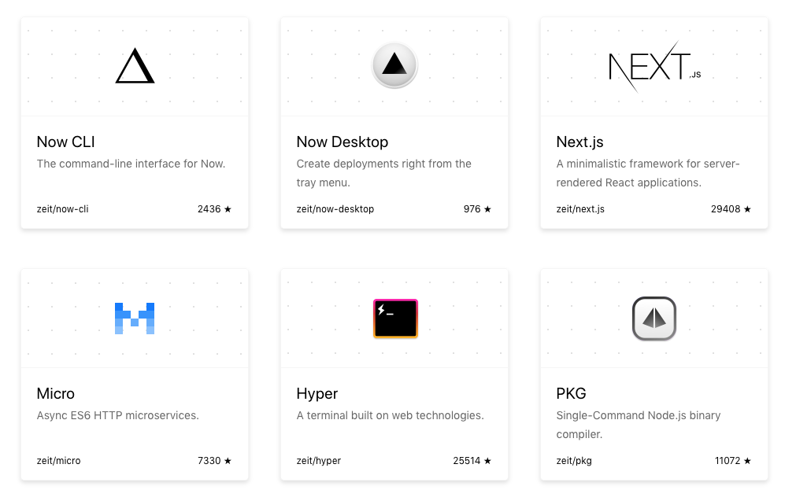
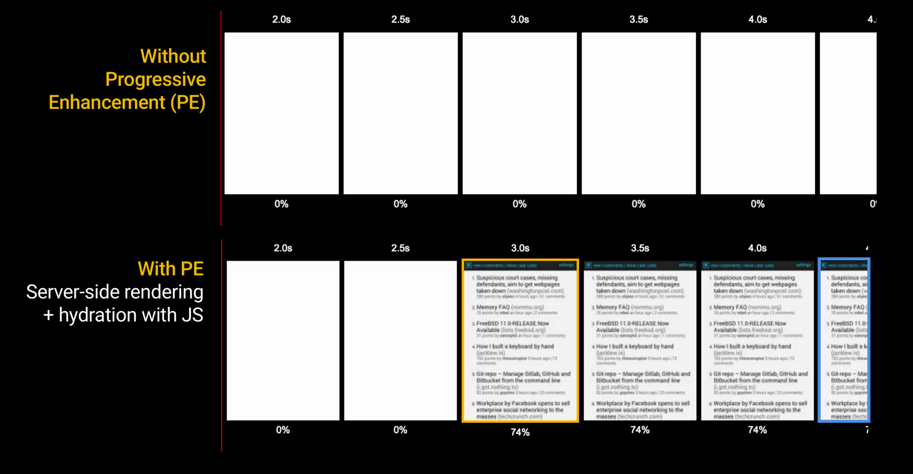
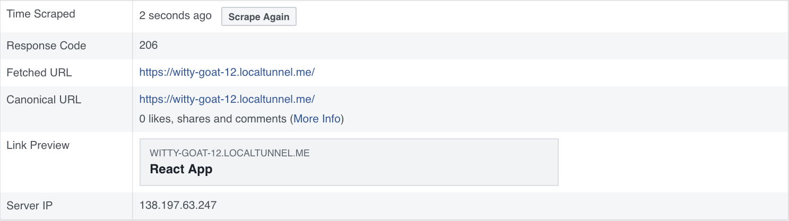
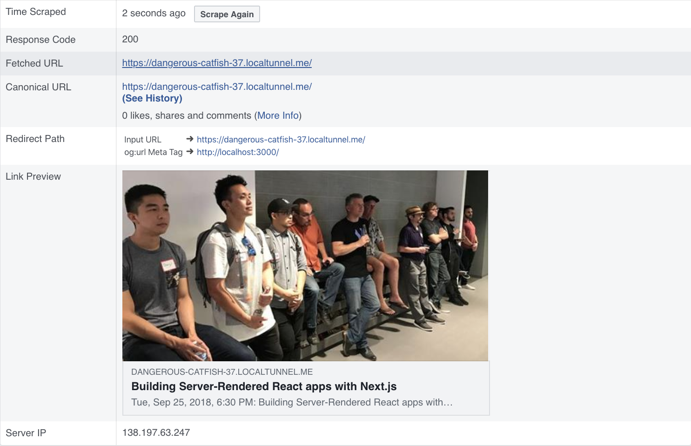

class: middle

# ReactJS OC
----

Building Server-rendered React Apps with Next.js

---

class: center, middle


???

### What is Next.js?

---

class: middle

> ## Next.js is a minimalistic framework for server-rendered React applications.
>
> ### \- zeit

---

class: center, middle



???

Next.js is developed by a company named Zeit.

They're behind a handful of really cool projects in the Open Source community as well as a streamlined serverless deployment service called `now`. And their team members are responsible for other libraries you may have used (`socket.io` for realtime apps or the `mongoose` Object-Document Mapper for MongoDB). Plus a bunch more, I'm sure.

---

class: middle

# 🔭 Overview
----

### 1. Getting Started with Next.js
### 2. Server-Side Rendering
### 3. Routing
### 4. Code Splitting
### 5. Loading Data
### 6. Customizing Webpack
### 7. Evaluating Next.js

???

We're going to cover a handful of things, many of which fade into the background while developing a Next.js application. But talking about them may help you get a sense of whether Next.js fits the bill for your next project; personal or professional.

---

class: middle, center

# 👶 Setting Up

???

We'll start out by seeing how simple it is to begin building an application with Next.js. There are actually only 3 tiny steps.

If you've ever worked in a modern JavaScript project, it's almost laughable, and certainly refreshing.

---

class: middle, center

# ⛓ Dependencies

???

Step one is to install a couple of dependencies.

---

class: middle

```bash
# create a package.json
npm init --yes
# install required dependencies
npm install --save next react react-dom
```

???

First we need a `package.json` and some dependencies.

The only _required_ dependecies when using next include `react` and `react-dom`, just like any basic React web project.

---

class: middle

> ## Next.js only supports React 16.
> ### We had to drop React 15 support due to the way React 16 works and how we use it.
> ### \- zeit

???

Something to keep in mind: The latest version of Next.js relies on features added to React 16. So if you are somehow constrained to an older version of React, maybe save Next.js for something greenfield. Next.js is maintained by a company with its own development resources and priorities so, as usual, we're just along for the ride.

---

class: middle, center

# 🤖 Scripts

???

Step Two is adding a couple of NPM scripts to `package.json`.

The Next.js package includes a command line executable that we can use in our `package.json` scripts.

---

class: middle

```json
{
  "scripts": {
    "dev": "next",
    "build": "next build",
    "start": "next start"
  }
}
```

???

If you are not familiar with NPM scripts, they're a property of the `Object` defined in `package.json` named `"scripts"`. The keys on the left are arbitrary names given to shell commands on the right. You execute them by name from the command line with the `npm run` command. No global CLI install is required and this way, the commands used to work on the project are as portable as NPM itself. These `dev`, `build`, and `start` script names are not mandatory for using Next.js; just an example.

---

class: middle, center

# 📁 Pages

???

Lastly, we need to create a directory and at least one React component.

---

class: middle

```bash
# make a "pages/" directory
mkdir pages/
# make a page component
code pages/index.js
```

???

The `pages/` directory is where Next.js looks for the various screens in our application. It's similar to how a web server serves static files, except that instead of HTML or image files, you populate it with React components. This directory is mandatory. The name `pages/` used to be configurable, but not for any good reason so it's not anymore.

---

class: middle

```jsx
// pages/index.js

export default function Index() {
  return (
    <h1>Hello, ReactJS OC&#33;</h1>
  )
}
```

???

Here's a simplistic Next.js page.

---

class: middle

```jsx
// pages/index.js

import { Component } from 'react'

export default class Index extends Component {
  render() {
    return (
      <h1>Hello, ReactJS OC&#33;</h1>
    )
  }
}
```

???

It could also be a `class` component. That doesn't matter; it just needs to be the `default` export either way.

---

class: middle, center

# 🚀 RUN IT

---

class: middle

```bash
.
├── node_modules/
│   ├── next/
│   ├── react/
│   └── react-dom/
├── pages/
│   └── index.js
└── package.json
```

???

By this point, this is what we're working in.

We installed three dependencies: `next`, `react`, and `react-dom`. We added some scripts to `package.json`. We created a `pages/` directory with a component in it.

---

class: middle, center

# 🎓 Setting Up

???

Building "Hello, World!" with Next.js is very straight-forward. There isn't a ton of boilerplate code and configuration needed.

---

class: middle

> ## Next.js is a **minimalistic** framework for server-rendered **React** applications.
>
> ### \- zeit

???

They're not lying so far.

---

class: middle, center

# 👶 Server-Side Rendering

---

class: middle, center

# SPA

```html
<div id="root"></div>
```

---

class: middle, center

# SSR

```html
<div id="__next">
  <h1>Hello, ReactJS OC!</h1>
  <h2>You handsome devils...</h2>
</div>
```

---

class: middle, center



---

class: middle

```jsx
import MetaTags from 'react-meta-tags'

export default function App() {
  return (
    <>
      <MetaTags>
        <meta property="og:site_name" content="SSR Demo!"/>
        <meta property="og:title" content="Building Server-Rendered React apps with Next.js"/>
        <meta property="og:type" content="article"/>
        <meta property="og:description" content="Tue, Sep 25, 2018, 6:30 PM: Building Server-Rendered React apps with Next.jsTim Davis – Instructor at Orange County Code SchoolSetting up routing for a React project can get pretty complex. How do you"/>
        <meta property="og:url" content="http://localhost:3000/"/>
        <meta property="og:image" content="https://secure.meetupstatic.com/photos/event/d/6/3/2/600_474714834.jpeg"/>
      </MetaTags>
      <h1>Hello, ReactJS OC!</h1>
      <h2>You handsome devils...</h2>
    </>
  )
}
```
---

class: middle, center



---

class: middle

```jsx
import NextHead from 'next/head'

export default function Index() {
  return (
    <>
      <NextHead>
        <meta property="og:site_name" content="SSR Demo!"/>
        <meta property="og:title" content="Building Server-Rendered React apps with Next.js"/>
        <meta property="og:type" content="article"/>
        <meta property="og:description" content="Tue, Sep 25, 2018, 6:30 PM: Building Server-Rendered React apps with Next.jsTim Davis – Instructor at Orange County Code SchoolSetting up routing for a React project can get pretty complex. How do you"/>
        <meta property="og:url" content="http://localhost:3000/"/>
        <meta property="og:image" content="https://secure.meetupstatic.com/photos/event/d/6/3/2/600_474714834.jpeg"/>
      </NextHead>
      <h1>Hello, ReactJS OC!</h1>
      <h2>You handsome devils...</h2>
    </>
  )
}
```

---

class: middle, center



---

class: middle

[Full Article](https://medium.com/@addyosmani/progressive-web-apps-with-react-js-part-4-site-is-progressively-enhanced-b5ad7cf7a447s)

> ## Progressive Web Apps with React.js
> ### - Addy Osmani

---

class: middle, center

# 🎓 Server-Side Rendering
